# TextUSM


<a href="https://www.npmjs.com/package/textusm.cli" target="_blank">
  
</a>


TextUSM is a simple tool. Help you draw user story map using indented text.

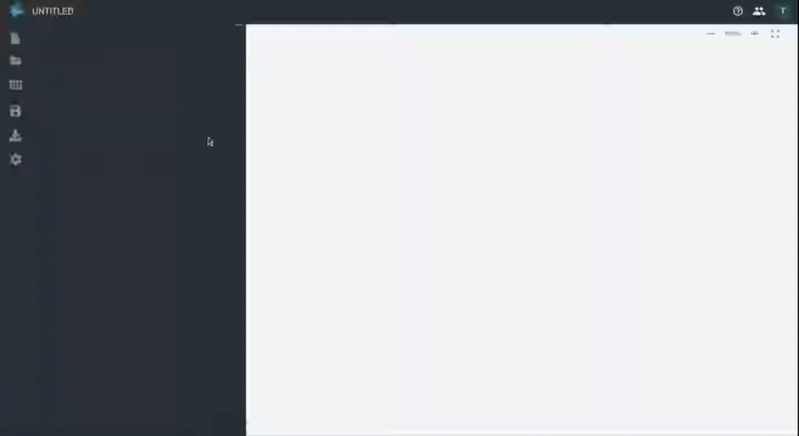

## Features

- Generate a Diagram from indented text
  - User Story Map
  - Business Model Canvas
  - Opportunity Canvas
  - User Persona
  - 4Ls Retrospective
  - Start, Stop, Continue Retrospective
  - KPT Retrospective
  - Mind Map
  - Empathy Map
  - Table
  - Site Map
  - Gantt Chart
  - Impact Map
  - ER Diagram
  - Kanban
  - Sequence Diagram
  - Freeform
  - Keyboard Layout
- Export a Diagram
  - SVG
  - PNG
  - TXT
  - PDF
  - DDL(only ER Diagram)
  - Markdown(only Table)

## Installation

- [Web](https://textusm.com)
- [VSCode Extension](https://marketplace.visualstudio.com/items?itemName=harehare.textusm)
- [cli](https://www.npmjs.com/package/textusm.cli)
- [npm](https://www.npmjs.com/package/textusm)

## Usage

```shell
# Set environment variables
cp .env.example .env
# Use direnv
echo 'dotenv' > .envrc

# Install dependencies
cd frontend && npm install

# Build, serve & watch
just run
```

Open http://localhost:3000 and start modifying the code in /src.

## Run tests

```
$ just test
```

<hr />

## Example

### User Story Map

```
TextUSM
    Online tool for making user story mapping
        Press Tab to indent lines
        Press Shift + Tab to unindent lines: Online tool for Generate a User Story Mapping from indented text.
```

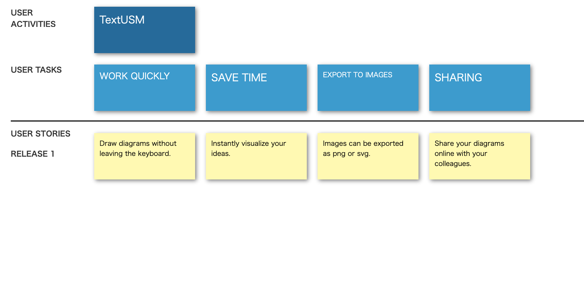

### Business Model Canvas

```
👥 Key Partners
    Key Partners
📊 Customer Segments
    Customer Segments
🎁 Value Proposition
    Value Proposition
✅ Key Activities
    Key Activities
🚚 Channels
    Channels
💰 Revenue Streams
    Revenue Streams
🏷️ Cost Structure
    Cost Structure
💪 Key Resources
    Key Resources
💙 Customer Relationships
    Customer Relationships
```

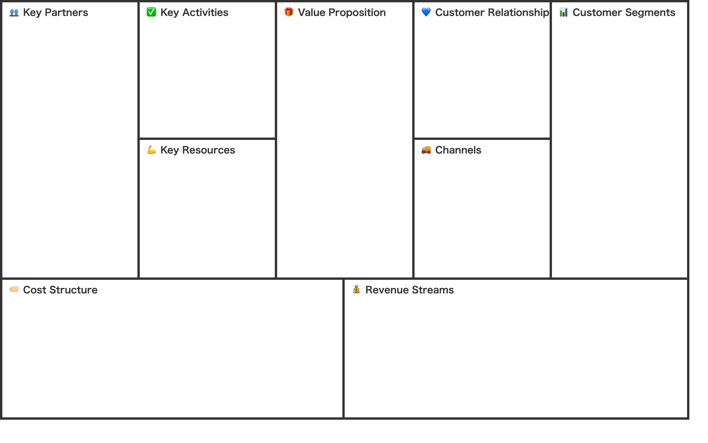

### Opportunity Canvas

```
Problems
    Problems
Solution Ideas
    Solution Ideas
Users and Customers
    Users and Customers
Solutions Today
    Solutions Today
Business Challenges
    Business Challenges
How will Users use Solution?
    How will Users use Solution?
User Metrics
    User Metrics
Adoption Strategy
    Adoption Strategy
Business Benefits and Metrics
    Business Benefits and Metrics
Budget
    Budget
```

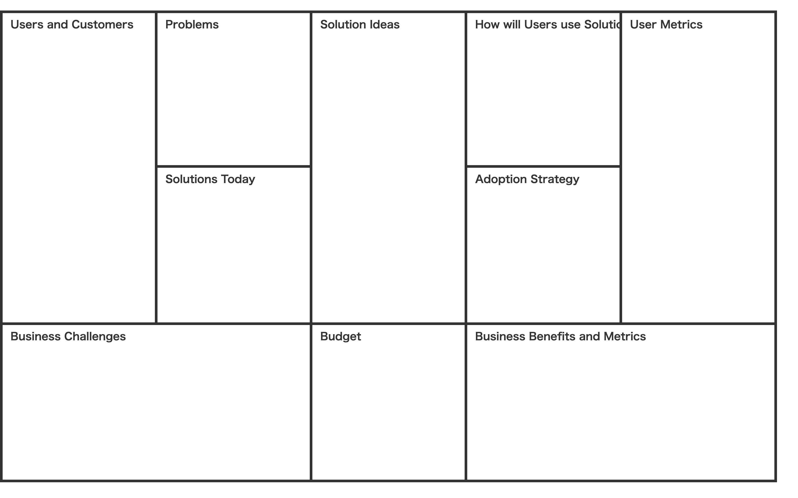

### 4Ls Retrospective

```
Liked
    Liked
Learned
    Learned
Lacked
    Lacked
Longed for
    Longed for
```

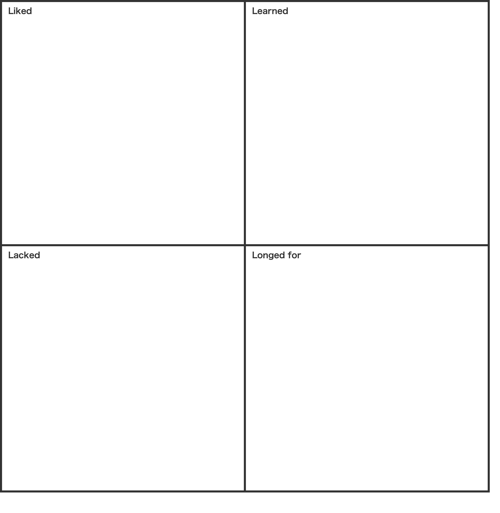

### Start, Stop, Continue Retrospective

```
Start
    Start
Stop
    Stop
Continue
    Continue
```

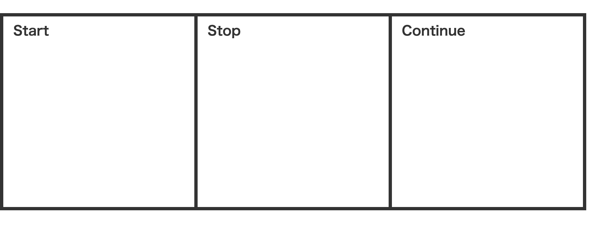

### KPT Retrospective

```
Keep
    Keep
Problem
    Problem
Try
    Try
```

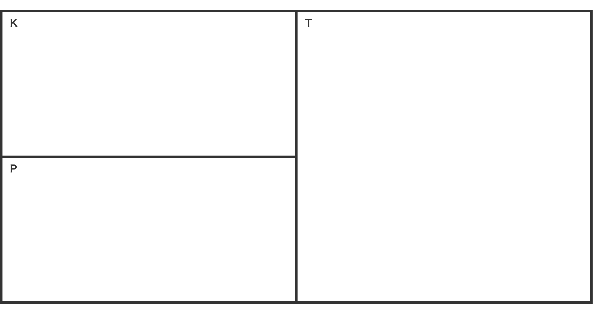

### MindMap

```
TextUSM
    WORK QUICKLY
        Draw diagrams without leaving the keyboard.
    SAVE TIME
        Instantly visualize your ideas.
    EXPORT TO IMAGES
        Images can be exported as png or svg.
    SHARING
        Share your diagrams online with your colleagues.
```

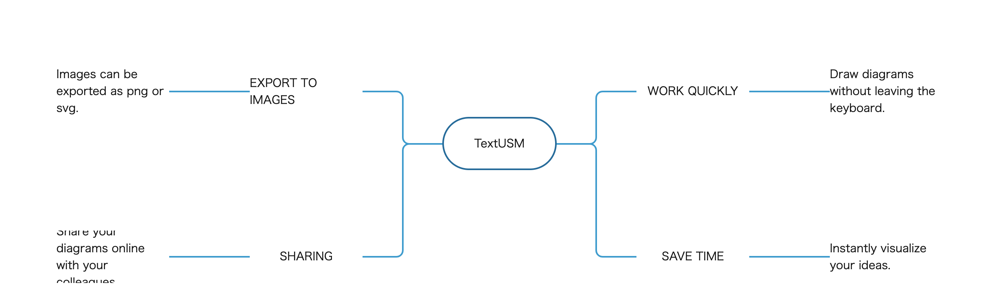

### Empathy Map

```
https://app.textusm.com/images/logo.svg
SAYS
THINKS
DOES
FEELS
```

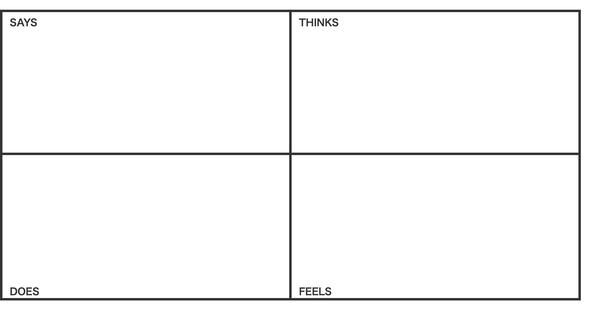

### Table

```
Column1
    Column2
    Column3
    Column4
    Column5
    Column6
    Column7
Row1
    Column1
    Column2
    Column3
    Column4
    Column5
    Column6
Row2
    Column1
    Column2
    Column3
    Column4
    Column5
    Column6
```

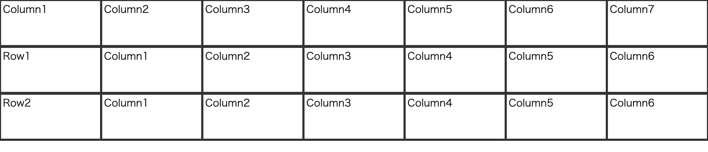

### Site Map

```
Home
    Download
        TextUSM
        Help you draw user story map using indented text.
        WORK QUICKLY
        SAVE TIME
    Privacy Policy
        Test
    Terms
        Test
    Contacts
        harehare1110@gmail.com
```

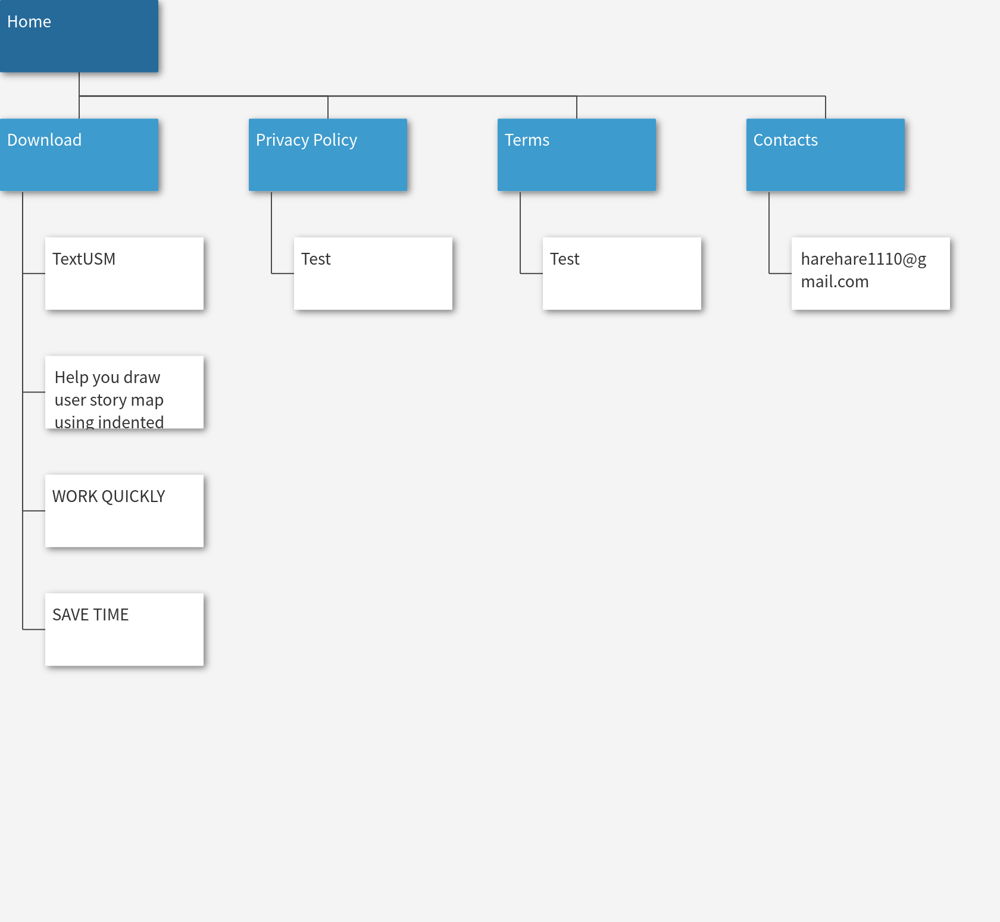

### Gantt Chart

```
2019-12-26 2020-02-29
    title1
        subtitle1
            2019-12-26 2019-12-31
    title2
        subtitle2
            2019-12-31 2020-01-04
```

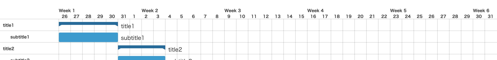

### Impact Map

```
TextUSM
    WORK QUICKLY
        Draw diagrams without leaving the keyboard.
    SAVE TIME
        Instantly visualize your ideas.
    EXPORT TO IMAGES
        Images can be exported as png or svg.
    SHARING
        Share your diagrams online with your colleagues.
```

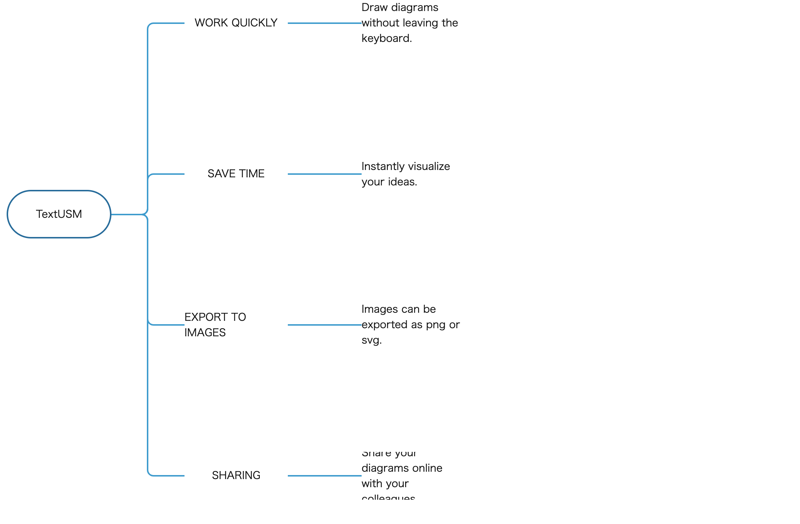

### ER Diagram

```
relations
    DiagramDetail - Diagram
    # One To Many
    User < Comment
    Diagram < Comment
    User < Diagram
    User < DiagramUser
    Diagram < DiagramUser
tables
    Diagram
        diagram_id int pk
        name varchar(255) not null
        type enum(userstorymap,mindmap)
        is_bookmark boolean default false
    DiagramDetail
        diagram_id int pk
        is_bookmark boolean default false
        is_public boolean default false
    Comment
        comment_id int pk
        comment text not null
        diagram_id int not null
        user_id int not null
    User
        user_id int pk
        name varchar(255)
    DiagramUser
        diagram_id int pk
        user_id int pk
```

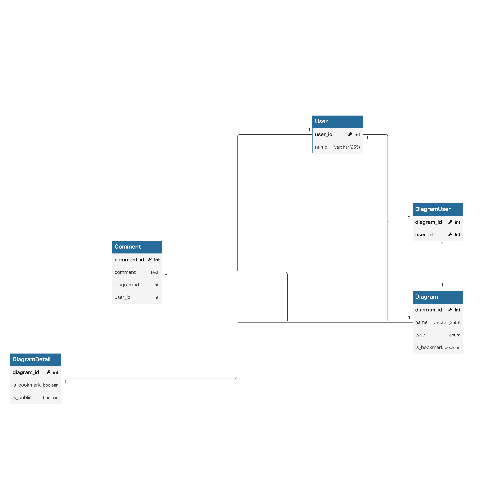

### Kanban

```
TODO
    task1
    task1
DOING
    task2
    task2
DONE
    task3
    task3
```

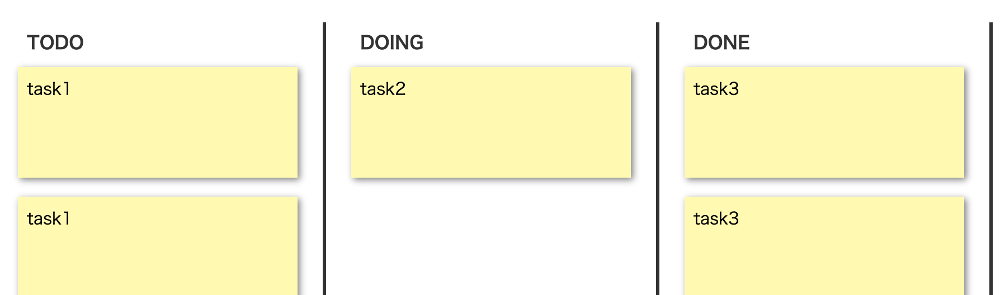

### Sequence Diagram

```
participant
    object1
    object2
    object3
object1 -> object2
    Sync Message
object1 ->> object2
    Async Message
object2 --> object1
    Reply Message
o-> object1
    Found Message
object1 ->o
    Stop Message
loop
    loop message
        object1 -> object2
            Sync Message
        object1 ->> object2
            Async Message
Par
    par message1
        object2 -> object3
            Sync Message
    par message2
        object1 -> object2
            Sync Message
```

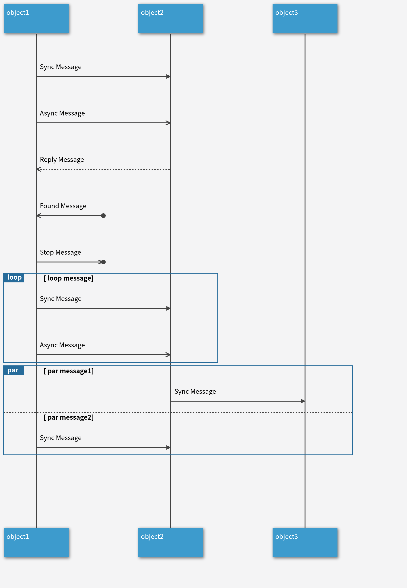

### Keyboard Layout

```
r4
    Esc
    !,1
    @,2
    {sharp},3
    $,4
    %,5
    ^,6
    &,7
    *,8
    (,9
    ),0
    _,-
    =,+
    |,\\
    ~,`
r4
    Tab,,1.5u
    Q
    W
    E
    R
    T
    Y
    U
    I
    O
    P
    {,[
    },]
    Backspace,,1.5u
r3
    Control,,1.75u
    A
    S
    D
    F
    G
    H
    J
    K
    L
    :,;
    \",'
    Enter,,2.25u
r2
    Shift,,2.25u
    Z
    X
    C
    V
    B
    N
    M
    <,{comma}
    >,.
    ?,/
    Shift,,1.75u
    Fn
r1
    1.25u
    Opt
    Alt,,1.75u
    ,,7u
    Alt,,1.75u
    Opt
    1.25u
```

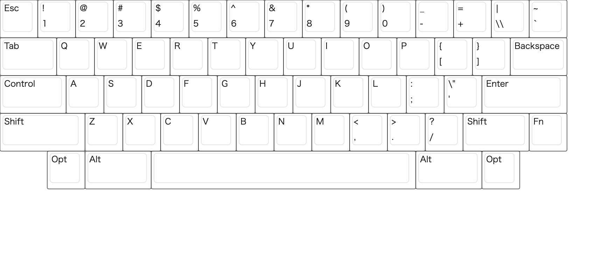

## 📝 License

[MIT](http://opensource.org/licenses/MIT)
