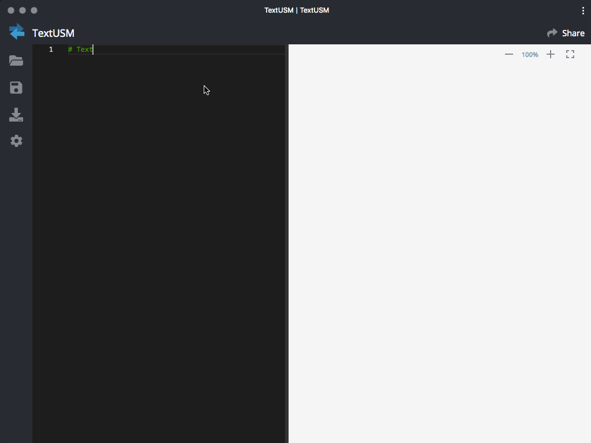
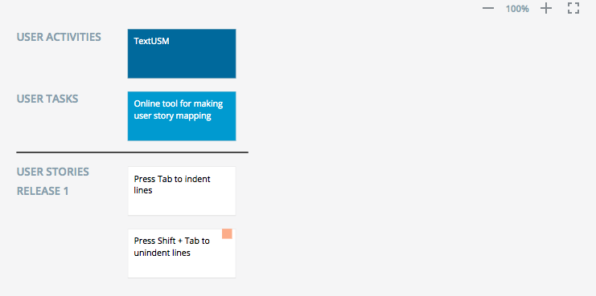
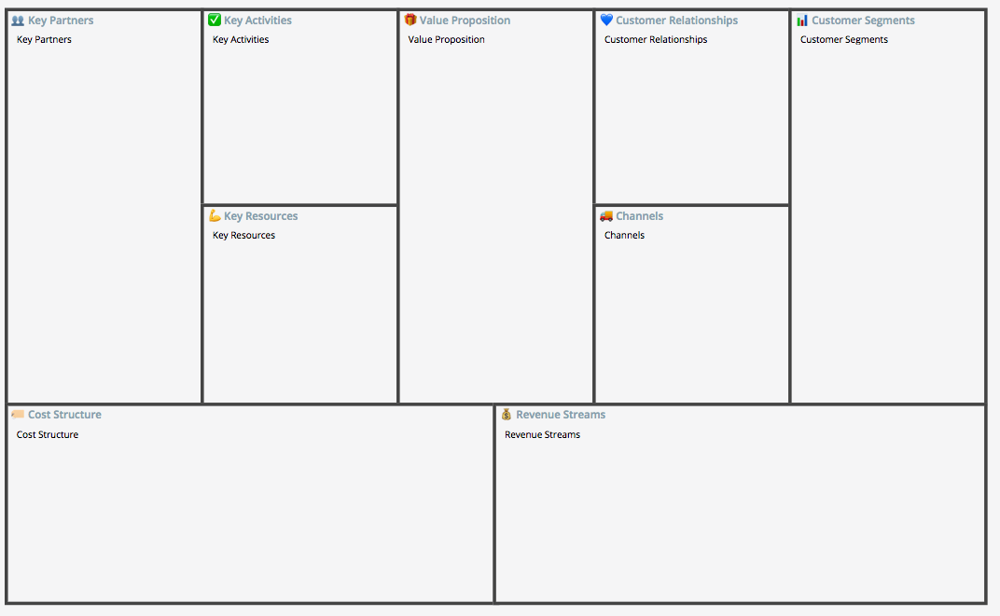
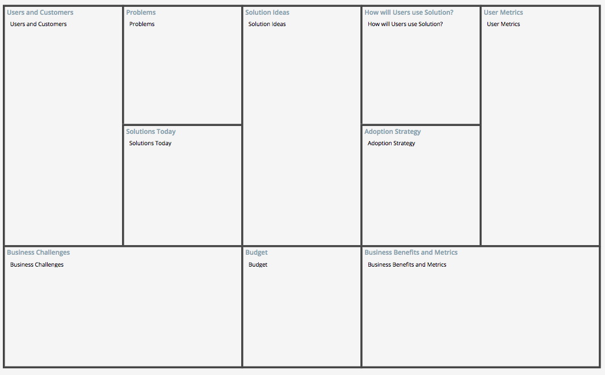
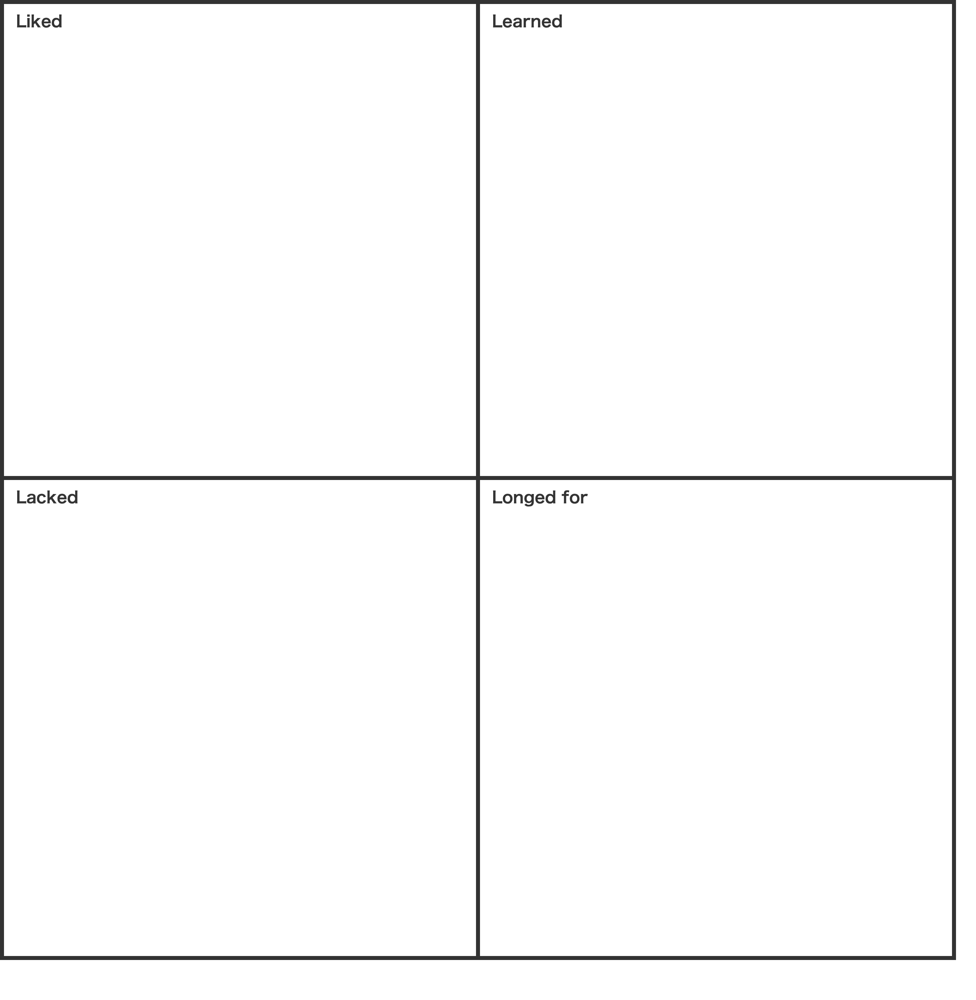
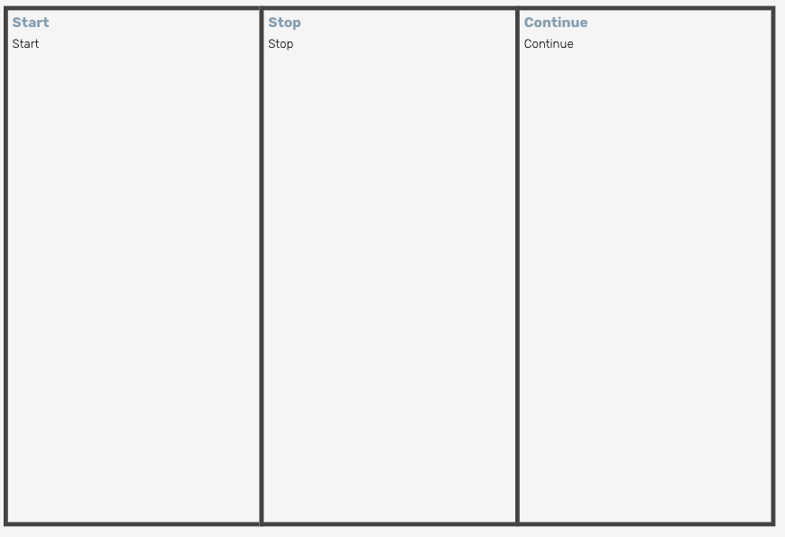

# TextUSM

[](https://travis-ci.com/harehare/textusm) [](LICENSE)

TextISM is a simple tool. Help you draw user story map using indented text.



## Features

- Generate a Diagram from indented text
  - User Story Map
  - Business Model Canvas
  - Opportunity Canvas
  - 4Ls Retrospective
  - Start, Stop, Continue Retrospective
  - KPT Retrospective
- Export a Diagram
  - SVG
  - PNG
  - TXT
  - Trello
  - Github

## Example

### User Story Map

```
# labels: USER ACTIVITIES, USER TASKS, USER STORIES, RELEASE1, RELEASE2, RELEASE3
# release1: 2019-06-01
# release2: 2019-06-30
# release2: 2019-07-31
TextUSM
    Online tool for making user story mapping
        Press Tab to indent lines
        Press Shift + Tab to unindent lines: Online tool for Generate a User Story Mapping from indented text.
```



### Business Model Canvas

```
👥 Key Partners
    Key Partners
📊 Customer Segments
    Customer Segments
🎁 Value Proposition
    Value Proposition
✅ Key Activities
    Key Activities
🚚 Channels
    Channels
💰 Revenue Streams
    Revenue Streams
🏷️ Cost Structure
    Cost Structure
💪 Key Resources
    Key Resources
💙 Customer Relationships
    Customer Relationships
```



### Opportunity Canvas

```
Problems
    Problems
Solution Ideas
    Solution Ideas
Users and Customers
    Users and Customers
Solutions Today
    Solutions Today
Business Challenges
    Business Challenges
How will Users use Solution?
    How will Users use Solution?
User Metrics
    User Metrics
Adoption Strategy
    Adoption Strategy
Business Benefits and Metrics
    Business Benefits and Metrics
Budget
    Budget
```



### 4Ls Retrospective

```
Liked
    Liked
Learned
    Learned
Lacked
    Lacked
Longed for
    Longed for
```



### Start, Stop, Continue Retrospective

```
Start
    Start
Stop
    Stop
Continue
    Continue
```



### KPT Retrospective

```
Keep
    Keep
Problem
    Problem
Try
    Try
```


## Installation

- [Web](https://textusm.web.app)
- [Android](https://play.google.com/store/apps/details?id=me.textusm.usm)
- [VSCode Extension](https://marketplace.visualstudio.com/items?itemName=harehare.textusm)
- [Chrome Extension](https://chrome.google.com/webstore/detail/godhdokkibfjekpoikkghnjgemibmhka)
- [CLI](https://www.npmjs.com/package/textusm.cli)
- [npm](https://www.npmjs.com/package/textusm)

## Developing

```sh
$ npm run dev
```

Open http://localhost:3000 and start modifying the code in /src.

## Production

```sh
npm run prod
```

## Testing

```
$ npm run test
```

<hr />

## License

[MIT](http://opensource.org/licenses/MIT)
