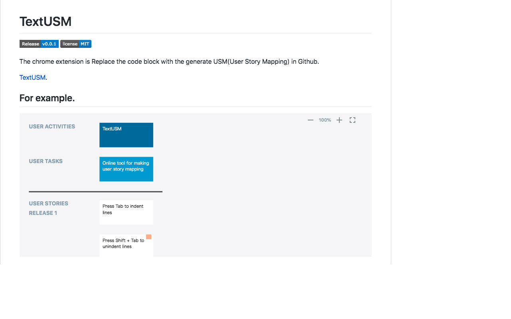

# TextUSM

 [](LICENSE)

The chrome extension is Replace the code block with the generate USM(User Story Mapping) in Github.

[TextUSM](./README.md).



## For example.

```textusm
# labels: USER ACTIVITIES, USER TASKS, USER STORIES, RELEASE1, RELEASE2, RELEASE3
# release1: 2019-06-01
# release2: 2019-06-30
# release2: 2019-07-31
TextUSM
    Online tool for making user story mapping
        Press Tab to indent lines
        Press Shift + Tab to unindent lines: Online tool for Generate a User Story Mapping from indented text.
```

## Installation

[From Chrome web store](https://chrome.google.com/webstore/detail/godhdokkibfjekpoikkghnjgemibmhka)

## Features

- Selection text convert to USM
- Replace the code block with the generated USM.
- Open TextUSM

## License

[MIT](http://opensource.org/licenses/MIT)
