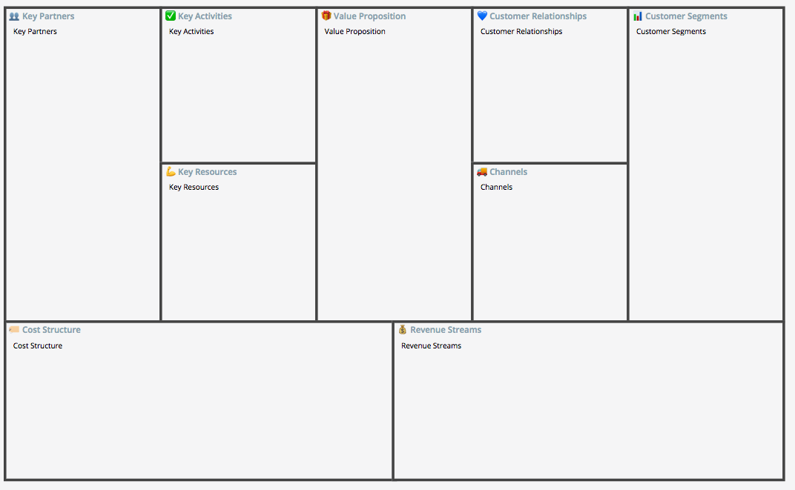
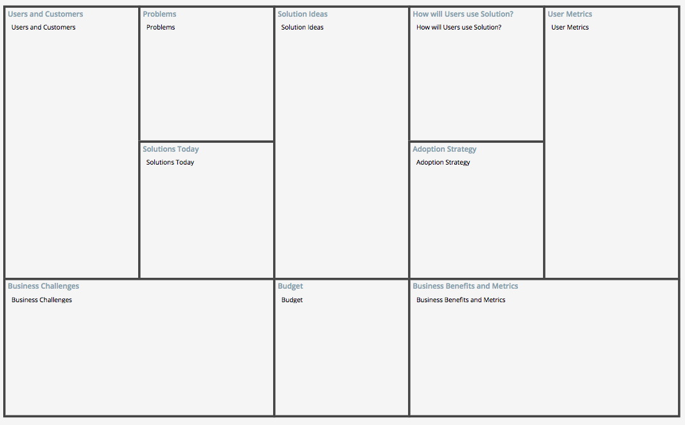
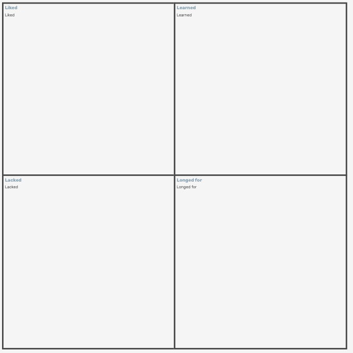
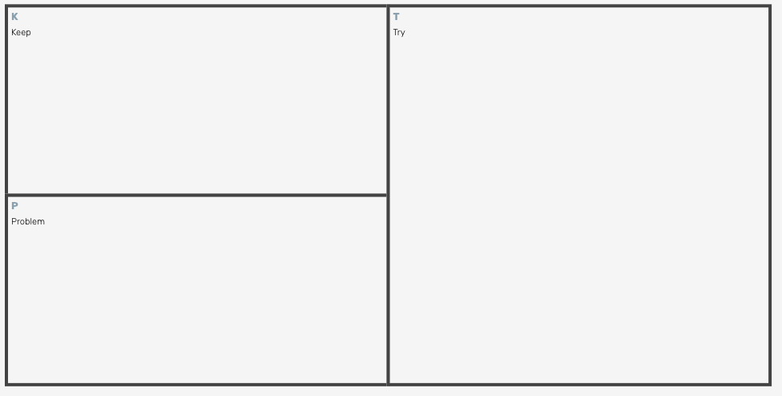

# TextUSM

 [](LICENSE)

Generate a Diagram from indented text.

- User Story Map
- Business Model Canvas
- Opportunity Canvas
- 4Ls Retrospective
- Start, Stop, Continue Retrospective
- KPT Retrospective
- User Persona
- Mind Map
- Table
- SiteMap
- Gantt Chart
- Impact Map
- ER Diagram
- Kanban
- Sequence Diagram

## Installation

```bash
$ npm i -S textusm
```

## How to use

### Text

```javascript
const textusm = require("textusm");
const elm = document.getElementById("id");

textusm.render(
  elm || "id",
  `
# labels: USER ACTIVITIES, USER TASKS, USER STORIES, RELEASE1, RELEASE2, RELEASE3
# release1: 2019-06-01
# release2: 2019-06-30
# release2: 2019-07-31
TextUSM
    Online tool for making user story mapping
        Press Tab to indent lines
        Press Shift + Tab to unindent lines: Online tool for Generate a User Story Mapping from indented text.`,
  // user story map size
  {
    size: { width: 1024, height: 1024 },
    showZoomControl: true,
  },
  // user story map configuration
  {}
);
```

### Object

```javascript
const textusm = require("textusm");
const elm = document.getElementById("id");

textusm.render(
  elm || "id",
  {
    name: "UserStoryMap",
    activities: [
      {
        name: "TextUSM",
        tasks: [
          {
            name: "Online tool for making user story mapping",
            stories: [
              {
                name: "Press Tab to indent lines",
                release: 1,
              },
              {
                name:
                  "Press Shift + Tab to unindent lines: Online tool for Generate a User Story Mapping from indented text.",
                release: 1,
              },
            ],
          },
        ],
      },
    ],
  },
  // user story map size
  {
    size: { width: 1024, height: 1024 },
    showZoomControl: true,
  },
  // user story map configuration
  {}
);
```


### Business Model Canvas

```javascript
const textusm = require("textusm");
const elm = document.getElementById("id");

textusm.render(
  elm || "id",
  {
    name: "BusinessModelCanvas",
    keyPartners: {
      title: "👥 Key Partners",
      text: ["Key Partners"],
    },
    customerSegments: {
      title: "📊 Customer Segments",
      text: ["Customer Segments"],
    },
    valueProposition: {
      title: "🎁 Value Proposition",
      text: ["Value Proposition"],
    },
    keyActivities: {
      title: "✅ Key Activities",
      text: ["Key Activities"],
    },
    channels: {
      title: "🚚 Channels",
      text: ["Channels"],
    },
    revenueStreams: {
      title: "💰 Revenue Streams",
      text: ["Revenue Streams"],
    },
    costStructure: {
      title: "🏷️ Cost Structure",
      text: ["Cost Structure"],
    },
    keyResources: {
      title: "💪 Key Resources",
      text: ["Key Resources"],
    },
    customerRelationships: {
      title: "💙 Customer Relationships",
      text: ["Customer Relationships"],
    },
  },
  {
    size: { width: 1024, height: 1024 },
    showZoomControl: true,
  },
  {}
);
```



### Opportunity Canvas

```javascript
const textusm = require("textusm");
const elm = document.getElementById("id");

textusm.render(
  elm || "id",
  {
    name: "OpportunityCanvas",
    problems: {
      title: "Problems",
      text: ["Problems"],
    },
    solutionIdeas: {
      title: "Solution Ideas",
      text: ["Solution Ideas"],
    },
    usersAndCustomers: {
      title: "Users and Customers",
      text: ["Users and Customers"],
    },
    solutionsToday: {
      title: "Solutions Today",
      text: ["Solutions Today"],
    },
    businessChallenges: {
      title: "Business Challenges",
      text: ["Business Challenges"],
    },
    howWillUsersUseSolution: {
      title: "How will Users use Solution?",
      text: ["How will Users use Solution?"],
    },
    userMetrics: {
      title: "User Metrics",
      text: ["User Metrics"],
    },
    adoptionStrategy: {
      title: "Adoption Strategy",
      text: ["Adoption Strategy"],
    },
    businessBenefitsAndMetrics: {
      title: "Business Benefits and Metrics",
      text: ["Business Benefits and Metrics"],
    },
    budget: {
      title: "Budget",
      text: ["Budget"],
    },
  },
  {
    size: { width: 1024, height: 1024 },
    showZoomControl: true,
  },
  {}
);
```



### 4Ls Retrospective

```javascript
const textusm = require("textusm");
const elm = document.getElementById("id");

textusm.render(
  elm || "id",
  {
    name: "4Ls",
    liked: { title: "liked", text: ["liked"] },
    learned: { title: "learned", text: ["learned"] },
    lacked: { title: "lacked", text: ["lacked"] },
    longedFor: { title: "longedFor", text: ["longedFor"] },
  },
  {
    size: { width: 1024, height: 1024 },
    showZoomControl: true,
  },
  {}
);
```



### Start, Stop, Continue Retrospective

```javascript
const textusm = require("textusm");
const elm = document.getElementById("id");

textusm.render(
  elm || "id",
  {
    name: "StartStopContinue",
    start: { title: "start", text: ["start"] },
    stop: { title: "stop", text: ["stop"] },
    continue: { title: "continue", text: ["continue"] },
  },
  {
    size: { width: 1024, height: 1024 },
    showZoomControl: true,
  },
  {}
);
```


### KPT Retrospective

```javascript
const textusm = require("textusm");
const elm = document.getElementById("id");

textusm.render(
  elm || "id",
  {
    name: "Kpt",
    keep: { title: "keep", text: ["keep"] },
    problem: { title: "problem", text: ["problem"] },
    try: { title: "try", text: ["try"] },
  },
  {
    size: { width: 1024, height: 1024 },
    showZoomControl: true,
  },
  {}
);
```



### MindMap

```javascript
const textusm = require("textusm");
const elm = document.getElementById("id");

textusm.render(
  elm || "id",
  `TextUSM
WORK QUICKLY
    Draw diagrams without leaving the keyboard.
SAVE TIME
    Instantly visualize your ideas.
EXPORT TO IMAGES
    Images can be exported as png or svg.
SHARING
    Share your diagrams online with your colleagues.`,
  {
    size: { width: 1024, height: 1024 },
    diagramType: "MindMap",
    showZoomControl: true,
  },
  {}
);
```


### Empathy Map

```javascript
const textusm = require("textusm");
const elm = document.getElementById("id");

textusm.render(
  elm || "id",
  {
    name: "EmpathyMap",
    imageUrl: "test",
    says: { title: "test", text: ["test"] },
    thinks: { title: "test", text: ["test"] },
    does: { title: "test", text: ["test"] },
    feels: { title: "test", text: ["test"] },
  },
  { diagramType: "EmpathyMap", size: { width: 2048, height: 1024 } }
);
```


### Table

```javascript
const textusm = require("textusm");
const elm = document.getElementById("id");

textusm.render(
  elm || "id",
  {
    name: "Table",
    header: [
        "Task",
        "Questions",
        "Touchpoints",
        "Emotions",
        "Influences",
        "Weaknesses",
      ],
    items: [
        [
          "Task",
          "Questions",
          "Touchpoints",
          "Emotions",
          "Influences",
          "Weaknesses",
        ],
        [
          "Task",
          "Questions",
          "Touchpoints",
          "Emotions",
          "Influences",
          "Weaknesses",
        ],
        [
          "Task",
          "Questions",
          "Touchpoints",
          "Emotions",
          "Influences",
          "Weaknesses",
        ],
        [
          "Task",
          "Questions",
          "Touchpoints",
          "Emotions",
          "Influences",
          "Weaknesses",
        ],
        [
          "Task",
          "Questions",
          "Touchpoints",
          "Emotions",
          "Influences",
          "Weaknesses",
        ],
      },
    ],
  },
  { diagramType: "Table", size: { width: 2048, height: 1024 } }
);
```


### Site Map

```javascript
const textusm = require("textusm");
const elm = document.getElementById("id");

textusm.render(
  elm || "id",
  `TextUSM
WORK QUICKLY
    Draw diagrams without leaving the keyboard.
SAVE TIME
    Instantly visualize your ideas.
EXPORT TO IMAGES
    Images can be exported as png or svg.
SHARING
    Share your diagrams online with your colleagues.`,
  {
    size: { width: 1024, height: 1024 },
    diagramType: "SiteMap",
    showZoomControl: true,
  },
  {}
);
```


### Gantt Chart

```javascript
const textusm = require("textusm");
const elm = document.getElementById("id");

textusm.render(
  elm || "id",
  {
    name: "GanttChart",
    from: "2019-12-26",
    to: "2020-01-31",
    title: "Test",
    chartitems: [
      {
        title: "subtitle1",
        schedules: [{ from: "2019-12-26", to: "2019-12-31", title: "task1" }],
      },
    ],
  },
  {
    size: { width: 1024, height: 1024 },
    diagramType: "GanttChart",
    showZoomControl: true,
  },
  {}
);
```


### Impact Map

```javascript
const textusm = require("textusm");
const elm = document.getElementById("id");

textusm.render(
  elm || "id",
  `TextUSM
WORK QUICKLY
    Draw diagrams without leaving the keyboard.
SAVE TIME
    Instantly visualize your ideas.
EXPORT TO IMAGES
    Images can be exported as png or svg.
SHARING
    Share your diagrams online with your colleagues.`,
  {
    size: { width: 1024, height: 1024 },
    diagramType: "ImpactMap",
    showZoomControl: true,
  },
  {}
);
```


### ER Diagram

```javascript
{
      name: "ER",
      relations: [
        {
          table1: "table1",
          table2: "table2",
          relation: "="
        },
        {
          table1: "table1",
          table2: "table2",
          relation: "-"
        }
      ],
      tables: [
        {
          name: "table1",
          columns: [
            {
              name: "column1",
              type: {
                name: "int"
              },
              attribute: { name: "pk" }
            }
          ]
        }
      ]
    }
```


### Kanban

```js
const textusm = require("textusm");
const elm = document.getElementById("id");

textusm.render(
  elm || "id",
  {
    name: "Kanban",
    lists: [
      { name: "Todo", cards: [{ text: "Todo text" }] },
      { name: "Doing", cards: [{ text: "Doing text" }] },
      { name: "Done", cards: [{ text: "Done text" }] },
    ],
  },
  {
    size: { width: 1024, height: 1024 },
    diagramType: "Kanban",
    showZoomControl: true,
  },
  {}
);
```

### Sequence Diagram

```js
const textusm = require("textusm");
const elm = document.getElementById("id");

textusm.render(
  elm || "id",
  {
    name: "SequenceDiagram",
    participants: ["object1", "object2", "object3"],
    items: [
      {
        kind: "messages",
        messages: [
          {
            kind: "->",
            from: "object1",
            to: "object2",
            text: "Sync Message",
          },
          {
            kind: "->>",
            from: "object1",
            to: "object2",
            text: "Async Message",
          },
          {
            kind: "-->",
            from: "object1",
            to: "object2",
            text: "Reply Message",
          },
          {
            kind: "o->",
            from: "",
            to: "object1",
            text: "Found Message",
          },
          {
            kind: "->o",
            from: "object1",
            to: "",
            text: "Stop Message",
          },
        ],
      },
      {
        kind: "loop",
        text: "loop message",
        items: [
          {
            kind: "messages",
            messages: [
              {
                kind: "->",
                from: "object1",
                to: "object2",
                text: "Sync Message",
              },
              {
                kind: "->>",
                from: "object1",
                to: "object2",
                text: "Async Message",
              },
            ],
          },
      },
      {
        kind: "par",
        messages: [
          {
            text: "par message1",
            items: [
              {
                kind: "messages",
                messages: [
                  {
                    kind: "->",
                    from: "object2",
                    to: "object3",
                    text: "Sync Message",
                  },
                ],
              },
            ],
          },
          {
            text: "par message2",
            items: [
              {
                kind: "messages",
                messages: [
                  {
                    kind: "->",
                    from: "object1",
                    to: "object2",
                    text: "Sync Message",
                  },
                ],
              },
            ],
          },
        ],
      },
    ],
  },
  {
    size: { width: 1024, height: 1024 },
    diagramType: "SequenceDiagram",
    showZoomControl: true,
  },
  {}
);
```


### Configuration

```javascript
{
    font: "Open Sans",
    size: {
      width: 140,
      height: 65
    },
    backgroundColor: "#F5F5F6",
    color: {
      activity: {
        color: "#FFFFFF",
        backgroundColor: "#266B9A"
      },
      task: {
        color: "#FFFFFF",
        backgroundColor: "#3E9BCD"
      },
      story: {
        color: "#000000",
        backgroundColor: "#FFFFFF"
      },
      comment: {
        color: "#000000",
        backgroundColor: "#F1B090"
      },
      line: "#434343",
      label: "#8C9FAE",
      text: "#111111"
    }
  }
}
```

## License

[MIT](http://opensource.org/licenses/MIT)
