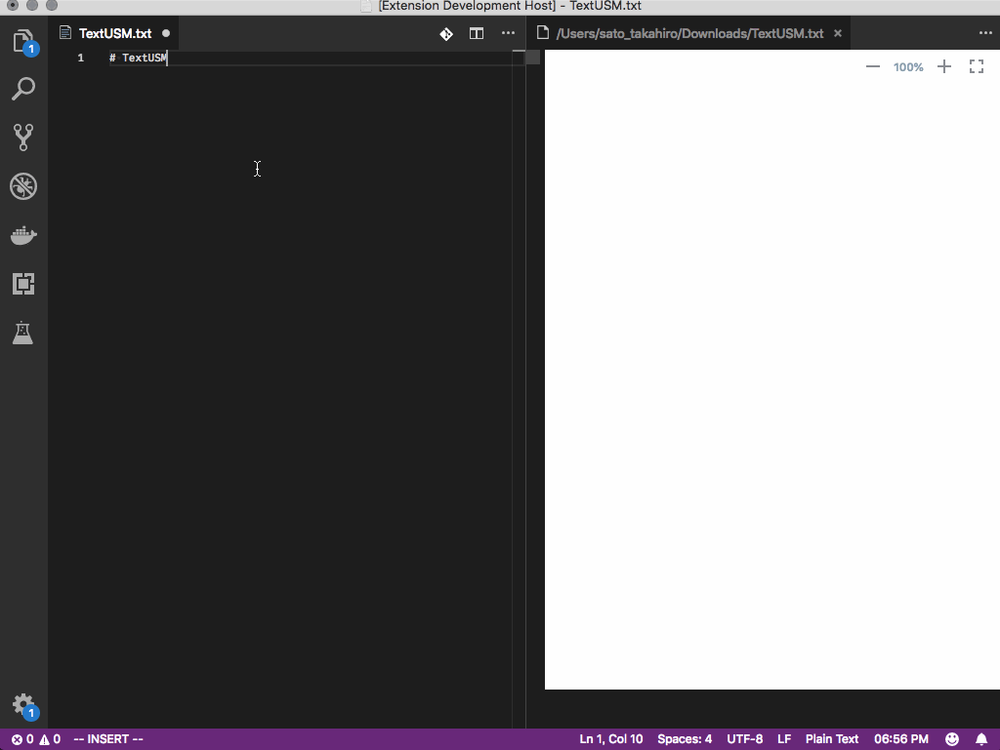

# TextUSM

  [](LICENSE)

TextISM is a simple tool. Help you draw user story map using indented text.

- User Story Map
- Business Model Canvas
- Opportunity Canvas
- 4Ls Retrospective
- Start, Stop, Continue Retrospective
- KPT Retrospective
- Mind Map
- Empathy Map
- Customer Journey Map
- Site Map



https://textusm.com

# Features

## Available Commands

- `TextUSM: New Diagram`
- `TextUSM: Open Preview`
- `TextUSM: Export SVG`
- `TextUSM: Export PNG`

# Example

## User Story Map

```
# labels: USER ACTIVITIES, USER TASKS, USER STORIES, RELEASE1, RELEASE2, RELEASE3
# release1: 2019-06-01
# release2: 2019-06-30
# release2: 2019-07-31
TextUSM
    Online tool for making user story mapping
        Press Tab to indent lines
        Press Shift + Tab to unindent lines: Online tool for Generate a User Story Mapping from indented text.
```


## Business Model Canvas

```
👥 Key Partners
    Key Partners
📊 Customer Segments
    Customer Segments
🎁 Value Proposition
    Value Proposition
✅ Key Activities
    Key Activities
🚚 Channels
    Channels
💰 Revenue Streams
    Revenue Streams
🏷️ Cost Structure
    Cost Structure
💪 Key Resources
    Key Resources
💙 Customer Relationships
    Customer Relationships
```


## Opportunity Canvas

```
Problems
    Problems
Solution Ideas
    Solution Ideas
Users and Customers
    Users and Customers
Solutions Today
    Solutions Today
Business Challenges
    Business Challenges
How will Users use Solution?
    How will Users use Solution?
User Metrics
    User Metrics
Adoption Strategy
    Adoption Strategy
Business Benefits and Metrics
    Business Benefits and Metrics
Budget
    Budget
```


### 4Ls Retrospective

```
Liked
  liked
Learned
  learned
Lacked
  lacked
Longed For
  longedFor
```


### Start, Stop, Continue Retrospective

```
Start
  Start
Stop
  stop
Continue
  continue
```


### KPT Retrospective

```
Keep
  keep
Problem
  problem
Try
  try
```


### MindMap

```
TextUSM
    WORK QUICKLY
        Draw diagrams without leaving the keyboard.
    SAVE TIME
        Instantly visualize your ideas.
    EXPORT TO IMAGES
        Images can be exported as png or svg.
    SHARING
        Share your diagrams online with your colleagues.
```


### Empathy Map

```
https://app.textusm.com/images/logo.svg
SAYS
THINKS
DOES
FEELS
```


### Customer Journey Map

```
Discover
    Task
    Questions
    Touchpoints
    Emotions
    Influences
    Weaknesses
Research
    Task
    Questions
    Touchpoints
    Emotions
    Influences
    Weaknesses
Purchase
    Task
    Questions
    Touchpoints
    Emotions
    Influences
    Weaknesses
Delivery
    Task
    Questions
    Touchpoints
    Emotions
    Influences
    Weaknesses
Post-Sales
    Task
    Questions
    Touchpoints
    Emotions
    Influences
    Weaknesses
```


### Site Map

```
Home
    Download
        TextUSM
        Help you draw user story map using indented text.
        WORK QUICKLY
        SAVE TIME
    Privacy Policy
        Test
    Terms
        Test
    Contacts
        harehare1110@gmail.com
```


## Options

```json
{
  "textusm.fontName": "Hiragino Kaku Gothic ProN",
  "textusm.exportDir": "/Users/sato_takahiro/Downloads",
  "textusm.backgroundColor": "#FFFFFF",
  "textusm.activity.backgroundColor": "#FFFFFF",
  "textusm.activity.color": "#000000",
  "textusm.story.backgroundColor": "#000000",
  "textusm.story.color": "#FFFFFFF",
  "textusm.task.backgroundColor": "#000000",
  "textusm.task.color": "#000000"
}
```

## License

[MIT](http://opensource.org/licenses/MIT)
